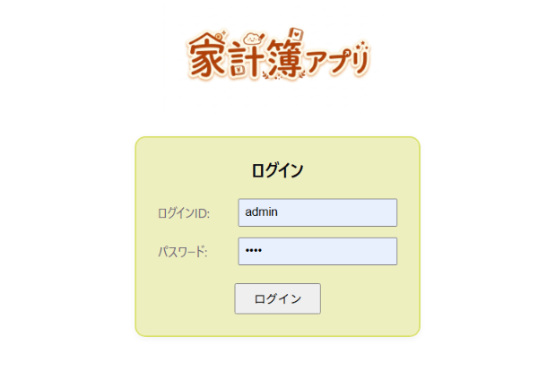
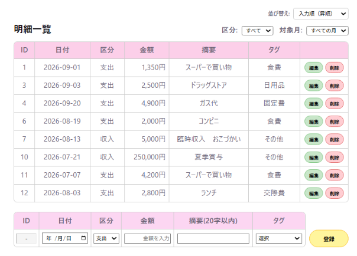
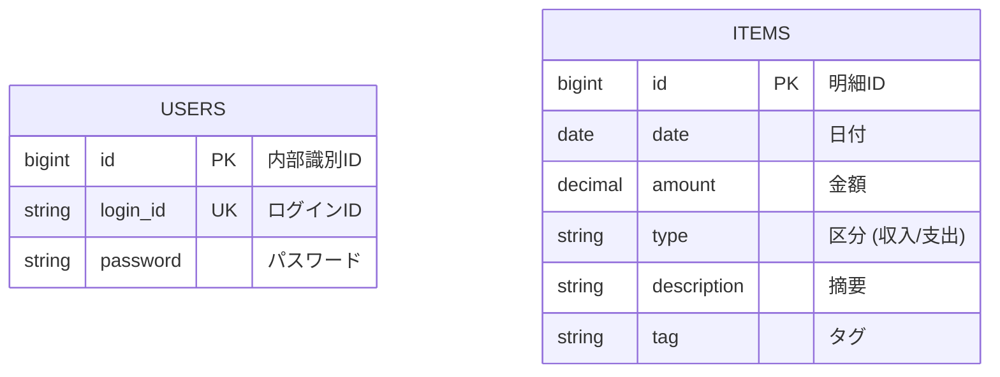

# 家計簿アプリ (Kakeibo App)

シンプルで迷わない、日常の収支管理を快適にするWebアプリケーション

---

## アプリケーションの概要

本アプリは、日々の収入・支出を簡単に記録・管理できる家計簿Webアプリケーションです。  
直感的な操作感とシンプルなUIにこだわり、月別の絞り込みや種別フィルター、柔軟な並び替え機能を備えています。

---

## 開発した背景・目的

私自身が日常の金銭管理を行う中で、「既存の家計簿アプリは機能が多くて操作が複雑」「もっと手軽に登録・確認ができるシンプルなツールが欲しい」と感じたことが開発のきっかけです。  
本プロダクトは、日々の入力ストレスを最小限に抑え、ユーザーがいつでも自分の収支状況をひと目で把握できるようにすることを目指して開発しました。

---

## 画面・機能の説明

### 1. ログイン画面

- ユーザー認証によるセキュリティ確保
- テストアカウントでの即時試用が可能（ID: `admin` / Password: `root`）



### 2. 明細一覧・ダッシュボード・新規登録画面

- **収支データの表示・登録・編集・削除**: テーブル形式で収支を一元管理
- **フィルター機能**: 「月選択（YYYY-MM）」や「種別（収入/支出）」による絞り込み表示
- **並び替え（ソート）機能**: 「登録順（古い順/新しい順）」「日付順（新しい順/古い順）」の切替
- **入力チェック**: 未入力項目がある場合のバリデーション表示



### 3. 明細編集画面

- **登録済みデータの変更**: 選択した明細の「日付・種別・タグ・金額・メモ」を専用画面で安全に編集・更新
- **入力チェック**: 未入力項目がある場合のバリデーション表示


## 使用技術

| カテゴリ        | 技術・ライブラリ                                    |
| :-------------- | :-------------------------------------------------- |
| **Frontend**    | React (Vite), JavaScript, React Router, HTML5, CSS3 |
| **Backend**     | Java, Spring Boot, Spring Data JPA                  |
| **Database**    | MySQL                                               |
| **Build & Dev** | Node.js, Gradle / Maven, Git, GitHub                |

---

## ER図



---

## ##　セットアップ

### 必要環境

- Node.js (v18以上推奨)
- Java OpenJDK (17以上)
- MySQL (v8.0以上)
- Git

### インストール手順

```bash
# 1. リポジトリをクローン
git clone https://github.com/sa-honda43/kakeibo/.git
cd kakeibo

# 2. バックエンドの起動 (Spring Boot)
./mvnw spring-boot:run

# 3. フロントエンドの起動 (React)
cd kakeibo-frontend
npm install
npm run dev
```
